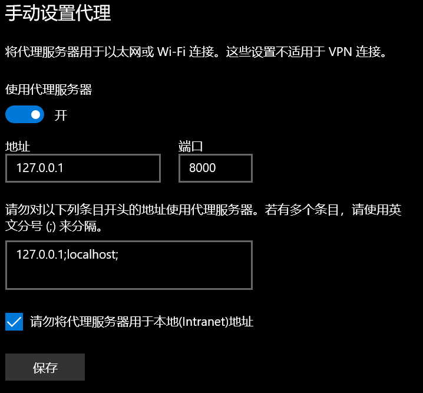
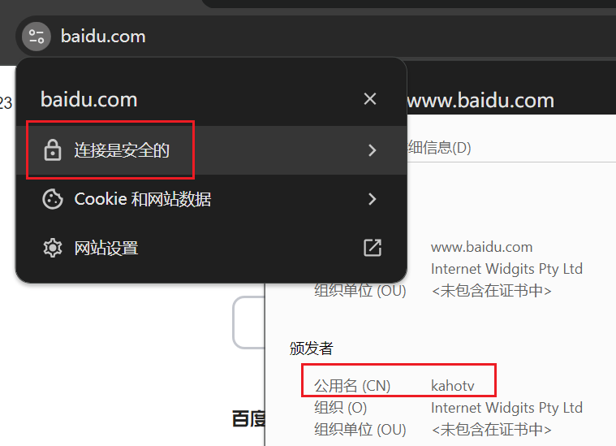

## C++ Version

https://github.com/kahotv/HttpsProxyCpp

## Build C#

直接编译就行，用的是系统库的Socket和Security实现转发和动态生成证书

## Transer

- SimpleTranser

  - 简单的转发数据包

- WebSocketTranser

  - 解析WebSocket协议

    ```bash
    WSRequest : 00 06 02 00 07 7E 08 00
    WSResponse: 00 0F 7E 01 01 02 00 08 00 10 E0 F2 F1 B8 06 08 00
    WSRequest : 00 06 02 00 0A 7B 08 00
    WSResponse: 00 0F AC 01 01 02 00 08 00 10 EF F2 F1 B8 06 08 00
    ```

    详见

    ```c#
    void PrintWebsocket(string host, byte[] data, bool up)
    {
        string dir = up ? "WSRequest :" : "WSResponse:";
        Console.WriteLine("{0} {1}", dir, Utils.Bin2Hex(data, 0, -1, " "));
    }
    ```
    
    

# Use

需要预先准备好ca.crt、ca.key和server.key，都是PEM结构。

1. 安装`ca.crt`到"**受信任的根证书颁发机构**"
2. 设置系统代理



3. 效果




## Cert

1. 生成`ca.key`

   ```bash
   openssl.exe genrsa -out ca.key 2048
   ```

2. 生成`ca.crt`

   ```bash
   openssl.exe req -new -x509 -days 36500 -key ca.key -out ca.crt
   ```

   ```
   Country Name (2 letter code) [AU]:CN
   State or Province Name (full name) [Some-State]:AA
   Locality Name (eg, city) []:BB
   Organization Name (eg, company) [Internet Widgits Pty Ltd]:
   Organizational Unit Name (eg, section) []:
   Common Name (e.g. server FQDN or YOUR name) []:kahotv
   Email Address []:
   ```

3. 生成`server.key`

   ```bash
   openssl.exe genrsa -out server.key 2048
   ```
